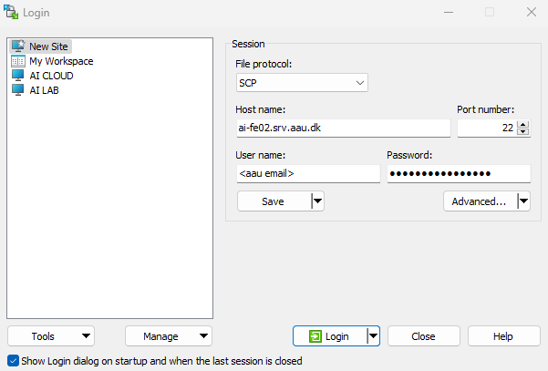

You are now logged into AI Cloud and are in your user directory, which is located at `/home/<domain>/<user>`. You can confirm this by typing `pwd`. This directory is your private storage space where you can keep all your files. It is stored on a network file system, so you can access your files from any [compute node](../help-and-resources/glossery.md#compute-nodes) within the platform.

Here is the general file structure on AI Cloud:

<div class="tree">
	<ul>
	<li><i class="fa fa-folder-open"></i> / <span>AI Cloud's file system</span>
		<ul>
		<li><i class="fa fa-folder-open"></i> home <span>user home directories</span>
			<ul>
			<li><i class="fa fa-folder-open"></i> [domain] <span>e.g student.aau.dk</span>
				<ul>
				<li><i class="fa fa-folder"></i> [user] <span>your user directory </span>
				</li>
				</ul>
			</li>
			</ul>
		</li>
		</ul>
	</li>
	</ul>
</div>

For a detailed overview of the AI Cloud storage system, click [here](../system-overview/storage.md).

<hr>

## Transfer files within AI Cloud
You can use the command `cp [source] [destination]` to copy files to and from directories within AI Cloud. 

<hr>

## Transfer files between your local computer and AI Cloud

===+ "Windows"
	You can transfer files between your local computer and AI Cloud using [WinSCP](https://winscp.net/eng/download.php). Other popular solutions are [PuTTY](https://www.putty.org/) and [FileZilla](https://filezilla-project.org/). Alternatively, you can install [OpenSSH](https://learn.microsoft.com/en-us/windows-server/administration/openssh/openssh_install_firstuse?tabs=gui) to use the `scp` command, as shown for [Linux/MacOS](#__tabbed_1_2) users.

	When you open WinSCP, you will be greeted by a *Login* modal. Follow the instructions in the image above to establish a connection to the server.
	
		
	You can now drag and drop files between your local computer and the AI Cloud platform.

	!!! info
		You might want to display hidden files in WinSCP (such as files starting with a dot on Linux systems). Go to Options → Preferences... → Panels and turn on "Show hidden files".

===+ "Linux/MacOS"

	You can transfer files between your local computer and AI Cloud using the command line utility `scp` from your local computer (**note:** You have to be logged out from AI Cloud to use `scp`).

	```console
	scp some-file user@domain.aau.dk@ai-fe02.srv.aau.dk:~/some-dir
	```

	Replace `user@domain.aau.dk` with your AAU email address.
	
	Here, `~` represents your user directory on AI Cloud and `/some-dir` a folder in your directory. 

	<hr>

	To copy files from AI Cloud to your local computer, use:


	```console
	scp user@domain.aau.dk@ai-fe02.srv.aau.dk:~/some-folder/some-subfolder/some-file .
	```

	Replace `user@domain.aau.dk` with your AAU email address.

	Here, `.` represents the current directory on your local computer.


<hr>

Now that you know the basics of file transfer, lets proceed to learn how to [**get applications :octicons-arrow-right-24:**](getting-applications.md)