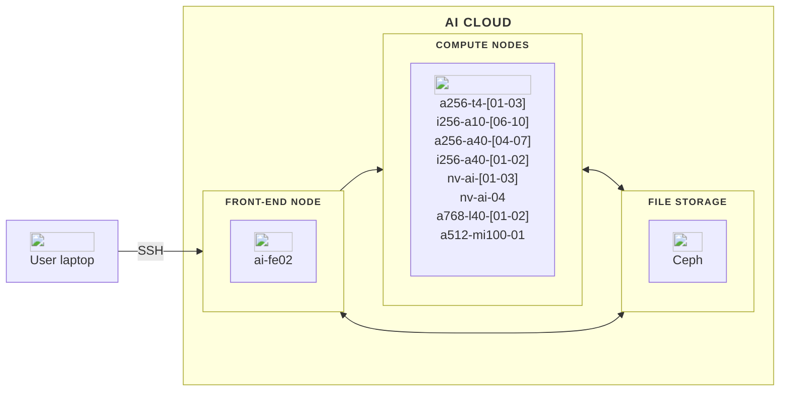

The AI Cloud platform is built around several key components, including a front-end node for managing tasks and code, and 21 compute nodes equipped with diverse hardware options.

In this overview, you will find a description of each major component of AI Cloud. Below, is a diagram illustrating the architecture of the AI Cloud platform.

## Front-end node
You start by logging into a front-end node, `ai-fe02`. This node act as the gateway to the HPC system. Here, you can manage files, write and edit code, and prepare your computational tasks. It is important to note that the front-end node are not intended for heavy computations; It is optimized for task preparation and interaction with the HPC environment.

## Compute nodes
AI Cloud currently include the following compute nodes:

| Name             | Nodes in total |GPUs per node     | CPU cores per node | CPU HW threads | RAM per node | RAM per GPU  | Disk         | NVLINK / NVSWITCH | Primary usage                         |
| ---              | ---            | ---              | ---                | ---            | ---          | ---          | ---          | ---               | ---                                   |
| a256-t4-[01-03]  | 3              | 6 (NVIDIA T4)    | 32 (AMD EPYC)      | 64             | 256 GB       | 16 GB        | None locally | No                | Interactive / smaller single-GPU jobs |
| i256-a10-[06-10] | 5              | 4 (NVIDIA A10)   | 32 (Intel Xeon)    | 64             | 256 GB       | 24 GB        | None locally | No                | Interactive / medium single-GPU jobs  |
| a256-a40-[04-07] | 4              | 3 (NVIDIA A40)   | 32 (AMD EPYC)      | 32             | 256 GB       | 48 GB        | None locally | No                | Large single-GPU jobs                 |
| i256-a40-[01-02] | 2              | 4 (NVIDIA A40)   | 24 (Intel Xeon)    | 24             | 256 GB       | 48 GB        | 6.4 TB /raid | Yes (2&times;2)   | Large single-/multi-GPU jobs          |
| nv-ai-[01-03]    | 3              | 16 (NVIDIA V100) | 48 (Intel Xeon)    | 96             | 1470 GB      | 32 GB        | 30 TB /raid  | Yes               | Large / batch / multi-GPU jobs        |
| nv-ai-04         | 1              | 8 (NVIDIA A100)  | 128 (AMD EPYC)     | 256            | 980 GB       | 40 GB        | 14 TB /raid  | Yes               | Large / batch / multi-GPU jobs        |
| a768-l40-[01-02] | 2              | 8 (NVIDIA L40)   |                    |                |              | 48 GB        |              | Yes               | Large / batch / multi-GPU jobs        |
| a512-mi100-01    | 1              | 8 (AMD MI100)    |                    |                |              | 32 GB        |              | Yes (Infinity Fabric link)| Large / batch / multi-GPU jobs        |

!!! info "Note"

    The compute nodes nv-ai-04, i256-a40-01, and i256-a40-02 are owned by specific research groups or centers which have first-priority access to them. Other users can only access them on a limitied basis where your jobs may be cancelled by higher-priority jobs. Users outside the prioritised group can only use them via the "batch" partition (use option `--partition=batch` for your jobs).
