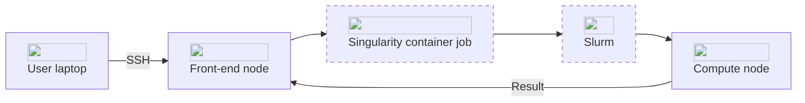

AI Cloud is based on Ubuntu Linux as its operating system. In practice, working on AI Cloud primarily takes place via a command-line interface.

AI Cloud leverages two primary software components: [Slurm](https://slurm.schedmd.com/quickstart.html) and [Singularity](https://docs.sylabs.io/guides/3.5/user-guide/introduction.html). Understanding these tools and how they work together is crucial for efficiently utilizing the AI Cloud platform.

## Slurm
[Slurm](https://slurm.schedmd.com/quickstart.html) is a powerful and highly configurable workload manager used for scheduling and managing compute jobs on AI Cloud. It provides essential features such as:

- **Job Scheduling:** Allocating resources to jobs based on user requests and system policies.
- **Resource Management:** Tracking and managing compute resources, ensuring optimal utilization.
- **Queue Management:** Organizing jobs into queues, prioritizing and executing them based on policies and resource availability.

On AI Cloud, Slurm is responsible for managing the allocation and scheduling of compute resources, ensuring that user jobs are executed efficiently and fairly.

## Singularity
[Singularity](https://docs.sylabs.io/guides/3.5/user-guide/introduction.html) is a container platform designed for running applications on AI Cloud. Containers are lightweight, portable, and reproducible environments that bundle an application's code, libraries, and dependencies. Key features of Singularity include:

- **Compatibility:** Running containers with high-performance computing workloads without requiring root privileges.
- **Portability:** Enabling the same container to run on different systems without modification.
- **Integration with HPC Systems:** Designed to work seamlessly with HPC job schedulers like Slurm.

## Interconnection of Slurm and Singularity
On AI Cloud, Slurm and Singularity work together. Slurm handles the job scheduling and resource allocation, while Singularity ensures that the specified container environment is instantiated and the application runs with all its dependencies.

